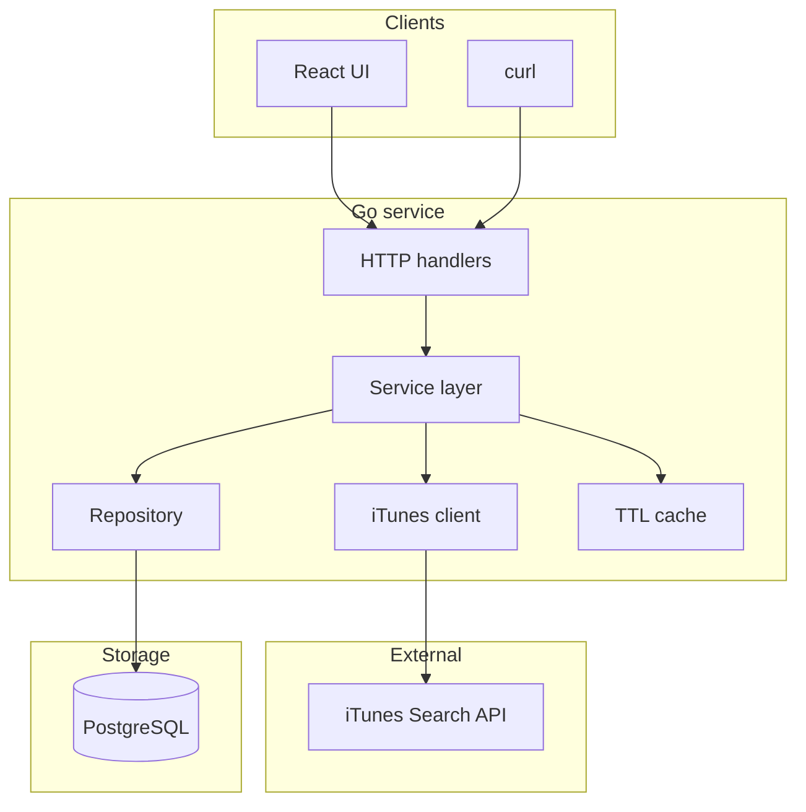

# Content Control Plane (Podcasts)

**NOTE:** This README is a **living document**: it will pick up runbooks, API details, schema notes, and tradeoffs as the submission solidifies.

---

## What this is

This repo is a **content control plane** for **podcast shows** (show-level metadata in v1—not a full episode catalog). It pulls from Apple’s **iTunes Search** API (`media=podcast`), **normalizes** results into **PostgreSQL**, and exposes a **JSON HTTP API** (plus a **Vite + React** UI under **`frontend/`**) so you can **sync** on demand, **browse** the catalog, **pin** rows for curation, and read an **append-only audit** trail plus **sync run** history. The same pattern applies anytime you’re integrating **someone else’s catalog**; podcasts are just a realistic, API-key-free example.

### What problem it solves

Teams often need to **surface third-party content** in a product, but the **vendor’s API is not your source of truth** for how you operate:

- **Shape and semantics differ** from what product, support, or compliance expect. You still need **your own schema**, stable internal keys, and room to attach **policy** (what’s allowed to appear, what’s promoted, what’s hidden).
- **Calling the vendor only at page-load time** means no durable answer to “what did we have yesterday?” if the API changes, throttles you, or returns bad data. A **stored, normalized copy** gives you something to diff, replay, and explain.
- **Curation and accountability** (“feature this show”, “who changed that flag?”) rarely belong in the vendor app. You want **your** workflows—**pin/unpin**, **audit events**, **sync runs** that record success/failure—on top of data **you** control.

This project is that **middle layer** in miniature: **ingest** from iTunes → **persist** under **`source_id` / your row shape** → **operator-facing** read and curation APIs. The same layout could later add scheduling, RBAC, or multi-tenant catalogs if scope grows.

---

## Run the project

**→ [docs/RUNNING.md](docs/RUNNING.md)** — includes Compose, ports, `curl` examples, Postgres GUI hints, and **`go test ./internal/... ./cmd/... ./tests/...`**. Open that file when you want to run or review the stack.

---

## Scope

### Current scope

- **Ingest** podcast *shows* (not full episode catalogs in v1) from a **public HTTP API**, map to an **internal schema** with a **stable external key** (`source_id`).
- **Persist** catalog + **sync run** history + **append-only audit** events in **PostgreSQL**.
- **Read path** with a **small in-process TTL cache** and explicit **cache invalidation** on writes that affect list/detail.
- **Curation:** at minimum **pin / unpin** with audit; **featured** reserved for follow-on UX if time allows.
- **Operator clarity:** how to run the stack and example API calls are in **[docs/RUNNING.md](docs/RUNNING.md)** (Docker-first).
- **Transparency:** tradeoffs stay in this doc; **how to run tests** is in **[docs/RUNNING.md](docs/RUNNING.md)**. See **AI usage** at the bottom for tooling disclosure.


---

## Why podcasts? 

- **Fits the challenge:** demonstrates a **real external API** over the network, **JSON transformation**, and **structured responses** without juggling API keys for v1.
- **iTunes Search (`media=podcast`)** returns **stable collection identifiers**, titles, publishers, **genres**, **feed URLs**, and **artwork**—enough to justify **normalization** and a **non-trivial internal row shape**.
- **Product-shaped story:** operators often need to **curate** what appears in a product surface; **pin + audit + sync runs** mirror how teams **govern** third-party catalogs.
- **Demo-friendly:** goal is for reviewers to **type a search query**, run sync, and **see rows land** in a DB-backed catalog—easy to narrate in a walkthrough.

---

## Problem?

Third-party catalog APIs are convenient but rarely match how **we** want to run the product internally. This repo is a **control plane** sketch: pull podcast show metadata, store a **normalized** copy under **your** keys, let operators **pin** rows, and keep a **light audit trail** and **sync run** history so we can explain what happened.

---

## Architecture

This matches what is in the repo today: **Vite + React** in **`frontend/`** and **`curl`** both hit the same Gin API.

### Request flow



### Layering

```
HTTP  →  service  →  repository  →  PostgreSQL
           ↓
     iTunes HTTP client
           ↓
     in-process TTL cache (read path)
```

- **Handlers:** transport only (status codes, binding, thin).
- **Service:** sync orchestration, cache invalidation policy, audit/sync_run writes.
- **Repository:** interface + Postgres implementation (`pgx`) for test seams.
- **iTunes package:** timeouts, retries, optional **mock** for offline runs.

---

## Repository structure

Current layout:

```
content-control-plane/
├── cmd/server/              # main()
├── internal/
│   ├── config/              # env / .env loading
│   ├── domain/              # shared models (JSON tags)
│   ├── handler/             # Gin routes
│   ├── service/             # business logic
│   ├── repository/          # Store interface + postgres
│   ├── client/itunes/       # external API + mock
│   └── cache/               # TTL wrapper
├── migrations/              # SQL (golang-migrate compatible)
├── tests/                   # cross-package scenario tests (presenter-oriented names)
├── frontend/                # Vite + React + TS
├── docs/
│   └── RUNNING.md           # runbook: Compose, UI, API checks, tests
├── docker-compose.yml
├── Dockerfile
├── .env.example
└── README.md
```

**`tests/`** holds cross-package **flow** scenarios (mock iTunes, sync, HTTP codes) with names that read well under **`go test ./tests/... -v`**. **`internal/service/normalize_test.go`** covers **ingest mapping** (`normalizeShow` is unexported, so those tests stay in-package).

---

## Data model

Implemented in **`migrations/`** (tables below).

- **`podcasts`** — internal `id`, unique **`source_id`** (e.g. iTunes `collectionId`), title, publisher/author, categories (`jsonb`), feed + artwork URLs, optional episode count, **`pinned` / `featured`**, timestamps. Upserts **refresh metadata** without clobbering curation flags on conflict.
- **`sync_runs`** — one row per sync attempt: query string, status, counts, errors, start/end times.
- **`audit_logs`** — append-only events (e.g. pin/unpin, sync completed/failed) with small JSON metadata.

---

## HTTP API

| Method | Path | Purpose |
|--------|------|---------|
| `GET` | `/health` | Liveness |
| `POST` | `/sync/podcasts?query=…` | Run ingest for search term |
| `GET` | `/podcasts` | List catalog |
| `GET` | `/podcasts/:id` | Detail by UUID |
| `POST` | `/podcasts/:id/pin` | Body `{"pinned": bool}`; writes audit |
| `GET` | `/audit-logs?limit=…` | Recent audit rows |

**Examples:** **[docs/RUNNING.md](docs/RUNNING.md)** (`curl` snippets).

---

## Tech stack

| Area | Choice | 
|------|--------|
| Runtime | Go 1.25+ (see `go.mod`) |
| HTTP | Gin | 
| DB | PostgreSQL | 
| Driver | pgx/v5 | 
| Migrations | golang-migrate (CLI) | 
| Cache | go-cache (memory) | 
| External API | iTunes Search | 
| UI | Vite + React + TS |
| Run | Docker Compose | 

---

## Design tradeoffs (early)

- **In-memory cache:** easy locally; not shared across replicas (Redis deferred as a future scope).
- **On-demand sync:** no scheduler in v1; reduces moving parts as I prioritize the scope.
- **iTunes:** subject to network and vendor behavior; mock mode for CI/offline.

---

## AI usage

I used AI-assisted tools (e.g. ChatGPT/Claude) mainly for the convenience around **boilerplate**, **documentation 
drafting**, and occasional **design iteration** especially for writing tests framework, frontend UI and UX improvements, layout choices and feature selection; **architecture decisions, and review-ready quality** 
---

## Third-party attribution

**iTunes Search API** is owned by Apple; this repo is an independent exercise and not affiliated with Apple.
