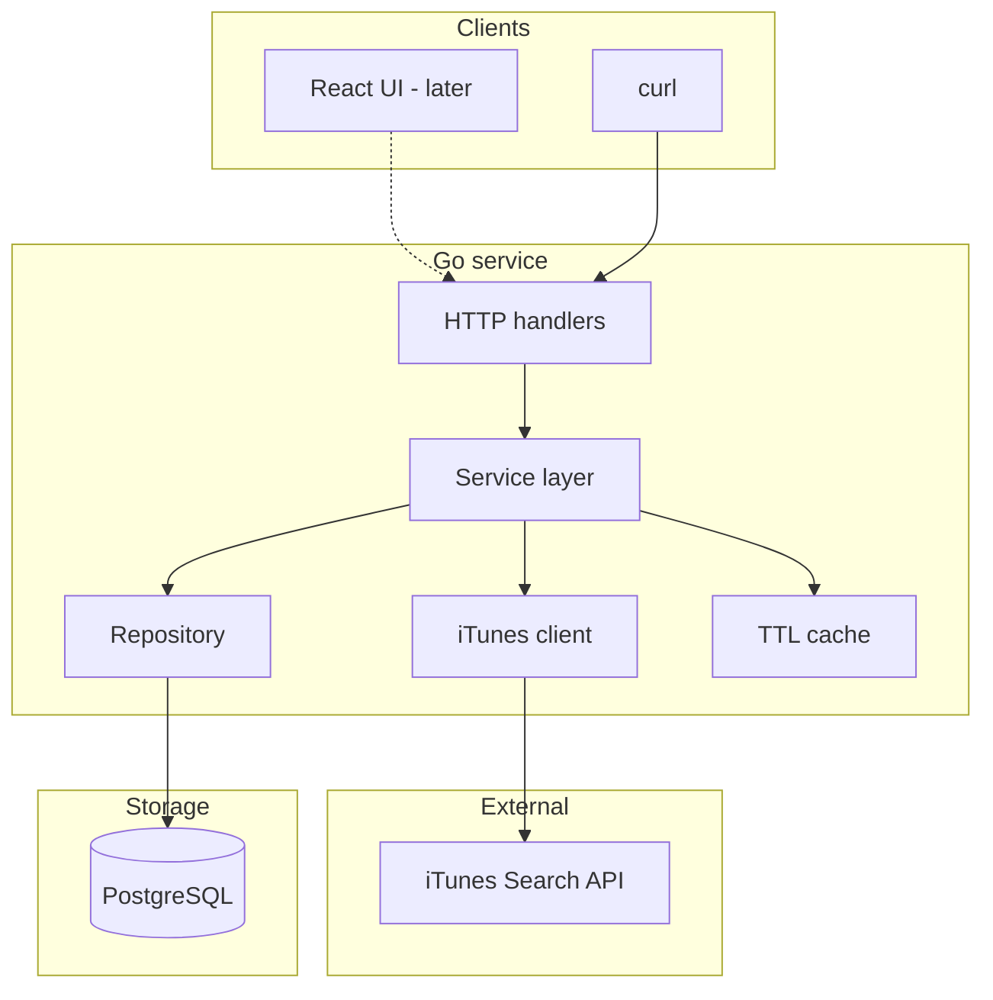

# Content Control Plane (Podcasts)

**NOTE:** This README file is a **living document**. It will be **updated as implementation progresses** runbooks, exact API paths, schema details, tradeoffs, and AI attribution, until **final commits** are in place for our submission. 

---

**Initial focus:** lock **architecture** and **target repository layout** before application code lands in committed steps.

This Go service will **call an external HTTP API** (Apple **iTunes Search**, `media=podcast`), **normalize** results into a **Postgres** catalog, optionally **cache** reads, and expose a small **JSON HTTP API** for **sync**, **reads**, **curation** (pin), and **audit**. A **Vite + React** UI is **planned** as an optional operator surface that uses the same API as `curl`.

---

## Scope

### Current scope

- **Ingest** podcast *shows* (not full episode catalogs in v1) from a **public HTTP API**, map to an **internal schema** with a **stable external key** (`source_id`).
- **Persist** catalog + **sync run** history + **append-only audit** events in **PostgreSQL**.
- **Read path** with a **small in-process TTL cache** and explicit **cache invalidation** on writes that affect list/detail.
- **Curation:** at minimum **pin / unpin** with audit; **featured** reserved for follow-on UX if time allows.
- **Operator clarity:** how to run the stack and example API calls are in **[docs/RUNNING.md](docs/RUNNING.md)** (Docker-first).
- **Transparency:** **AI usage** policy and (where helpful) **tradeoffs** and **testing** story in this doc or linked notes.


---

## Why podcasts? 

- **Fits the challenge:** demonstrates a **real external API** over the network, **JSON transformation**, and **structured responses** without juggling API keys for v1.
- **iTunes Search (`media=podcast`)** returns **stable collection identifiers**, titles, publishers, **genres**, **feed URLs**, and **artwork**,rich enough to justify **normalization** and a **non-trivial internal row shape**.
- **Product-shaped story:** operators often need to **curate** what appears in a product surface; **pin + audit + sync runs** mirror how teams **govern** third-party catalogs.
- **Demo-friendly:** goal is for reviewers to **type a search query**, run sync, and **see rows land** in a DB-backed catalog—easy to narrate in a walkthrough.

---

## Estimated week plan (days 6–7 as buffers if needed)

| Day | Deliverable |
|-----|-------------|
| **1** | Architecture + planned structure (**this document**) |
| **2** | Go module skeleton, Docker Compose, Postgres, SQL migrations |
| **3** | Persistence + iTunes client + service + HTTP handlers |
| **4** | Frontend wired to the API |
| **5** | Tests, polish, readability improvements in code |
| **6** | Buffer / stretch goals (TBD) |
| **7** | Buffer / final README + submission polish (TBD) |

---

## Problem?

Third-party catalog APIs are convenient but **not** shaped for internal workflows that we want to use as per our needs. This project models a **control plane**: pull remote podcast show metadata, store a **normalized** copy under **our** keys, let operators **pin** rows, and keep a **light audit trail** and **sync run** history so behavior is explainable.

---

## Target architecture

### Request flow (planned)



Dotted edge: UI is a later-day addition; the core is **CLI + API**.

### Layering

```
HTTP  →  service  →  repository  →  PostgreSQL
           ↓
     iTunes HTTP client
           ↓
     in-process TTL cache (read path)
```

- **Handlers:** transport only (status codes, binding, thin).
- **Service:** sync orchestration, cache invalidation policy, audit/sync_run writes.
- **Repository:** interface + Postgres implementation (`pgx`) for test seams.
- **iTunes package:** timeouts, retries, optional **mock** for offline runs.

---

## Planned repository structure (Will update as the mockup gets closer to completion)

Target layout once the tree is filled in:

```
content-control-plane/
├── cmd/server/              # main()
├── internal/
│   ├── config/              # env / .env loading
│   ├── domain/              # shared models (JSON tags)
│   ├── handler/             # Gin routes
│   ├── service/             # business logic
│   ├── repository/          # Store interface + postgres
│   ├── client/itunes/       # external API + mock
│   └── cache/               # TTL wrapper
├── migrations/              # SQL (golang-migrate compatible)
├── frontend/                # Vite + React + TS
├── docker-compose.yml
├── Dockerfile
├── .env.example
└── README.md
```

Directories may be created empty or appear as code is added day by day. (**For ex. tests/**)

---

## Planned data model
- **`podcasts`** — internal `id`, unique **`source_id`** (e.g. iTunes `collectionId`), title, publisher/author, categories (`jsonb`), feed + artwork URLs, optional episode count, **`pinned` / `featured`**, timestamps. Upserts should **refresh metadata** without clobbering curation flags on conflict.
- **`sync_runs`** — one row per sync attempt: query string, status, counts, errors, start/end times.
- **`audit_logs`** — append-only events (e.g. pin/unpin, sync completed/failed) with small JSON metadata.

Exact columns and migration files will be added subsequently.

---

## Planned HTTP surface (sketch)

- Health / readiness style endpoint.
- **Sync:** trigger ingest by **search query** (maps to iTunes `term` + `media=podcast`).
- **Catalog:** list and get-by-id.
- **Pin:** toggle pinned state; write audit.
- **Audit log:** recent entries for operators.

Concrete paths, request bodies, and examples will be documented once handlers exist.

---

## Intended tech stack

| Area | Choice | 
|------|--------|
| Runtime | Go 1.21+ |
| HTTP | Gin | 
| DB | PostgreSQL | 
| Driver | pgx/v5 | 
| Migrations | golang-migrate (CLI) | 
| Cache | go-cache (memory) | 
| External API | iTunes Search | 
| UI | Vite + React + TS (should seamlessly transition into Vue)| 
| Run | Docker Compose | 

---

## Design tradeoffs (early)

- **In-memory cache:** easy locally; not shared across replicas (Redis deferred as a future scope).
- **On-demand sync:** no scheduler in v1; reduces moving parts as I prioritize the scope.
- **iTunes:** subject to network and vendor behavior; mock mode for CI/offline.

---

## AI usage

I plan to use AI-assisted tools (e.g. ChatGPT/Claude) mainly for the convenience around **boilerplate**, **documentation drafting**, and occasional **design iteration**; **architecture decisions, and review-ready quality** 

---

## Third-party attribution

**iTunes Search API** is owned by Apple; this repo is an independent exercise and not affiliated with Apple.
